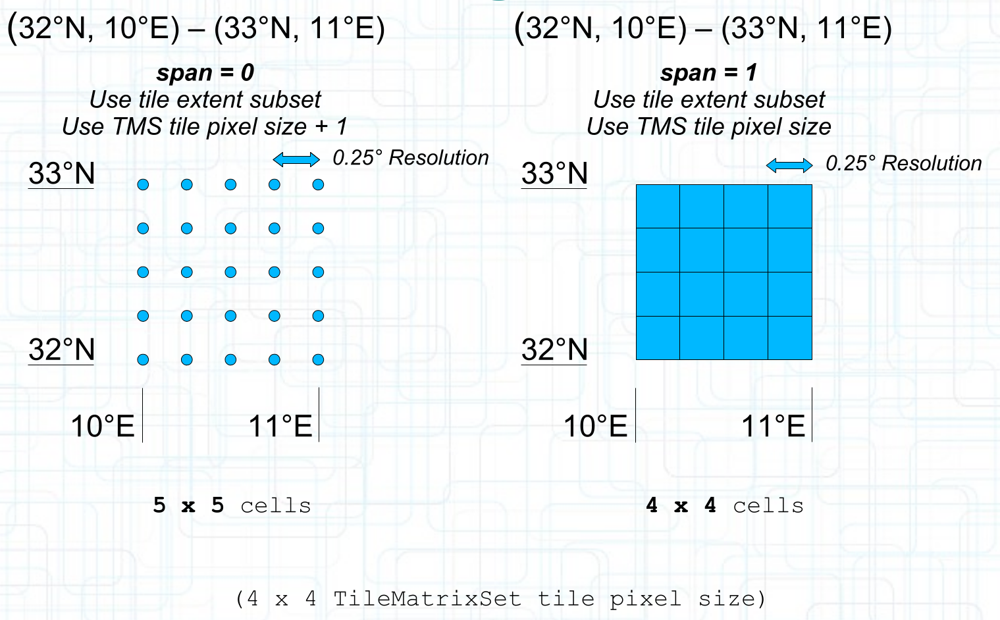

[[rc-coverage-tiles]]
== Requirements Class "Coverage Tiles"

=== Overview

The "Coverage Tiles" Requirements Class defines how to combine the _OGC API - Tiles_ building blocks with the _Coverages API_ to request coverage tiles.
Coverages parameters such as for subsetting additional dimensions not covered by the Tiles 2D Tile Matrix Set (such as time or elevation),
or for range subsetting, can be used together with the path for requesting individual tiles.

The tiles response for a coverage corresponds to a subsetting request for the tile extent.
Note that the number of cells in the response for a _Value-Is-Point_ coverage is one more than the tile pixel size of the TileMatrixSet.

[#span-coverage-tiles,reftext='{figure-caption} {counter:fig-num}']
.The cells returned for a tile response of a gridded coverage for _Value-is-Point_ (span = 0) and _Value-is-Area_ (span = 1)

=== Coverage Tiles Examples

See also <<coverage-tiles-examples, examples of coverage tile requests>> in an annex.

include::requirements/requirements_class_coverage_tiles.adoc[]
