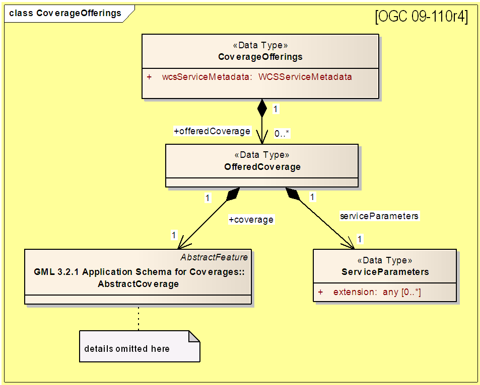

[[overview]]
== Overview

[[general-overview]]
=== General

The OGC API family of standards enable access to resources using the HTTP protocol and its' associated operations (GET, PUT, POST, etc.). OGC API-Common defines a set of features which are applicable to all OGC APIs. Other OGC standards extend API-Common with features specific to a resource type. This OGC API-Coverages standard defines an API with two goals:

. Provide access to *_Coverages_* conformant to the <<coverage-implementation-schema-overview,OGC CIS standard>>.
. Provide functionality comparable to that of the <<web-coverage-service-overview,OGC WCS standard>>.

Resources exposed through an OGC API may be accessed through a Universal Resource Identifier <<rfc3986,(URI).>> URIs are composed of three sections:

* Dataset distribution API: The endpoint corresponding to a dataset distribution, where the landing page resource as defined in OGC API - Common - Part 1: Core is available (subsequently referred to as Base URI or `{datasetAPI}`)
* Access Paths: Unique paths to Resources
* Query: Parameters to adjust the representation of a Resource or Resources like encoding format or subsetting

Access Paths are used to build resource identifiers. It is recommended, but not required, that these paths

Most resources are also accessible through links on previously accessed resources. Unique relation types are used for each resource.

<<coverage-paths>> summarizes the access paths and relation types defined in this standard.

[#coverage-paths,reftext='{table-caption} {counter:table-num}']
.Coverage API Resources
[width="90%",cols="2,^1,4",options="header"]
|===
^|Resource URI ^|Relation Type ^|Description
|<<landing-page,{datasetAPI}/>> |`ogc:common:dataset` |Landing page for this dataset distribution
|<<api-definition,{datasetAPI}/api>> |`service-desc` | API description (e.g. OpenAPI)
|<<api-definition,{datasetAPI}/api>> |`service-doc` | API documentation (optional, e.g. HTML)
|<<conformance-classes,{datasetAPI}/conformance>> |`conformance` |Conformance Classes
|<<collections-metadata,{datasetAPI}/collections>> |`data` |The list off all collections available, some or all of which may be accessible using this Coverage API. Each of these collection objects take the same form as that of the collection resource object described immediately below.
|<<collection-description,{datasetAPI}/collections/{collectionId}>> |`ogc:common:collection` |resource corresponding to the collection with the unique identifier `{collectionId}`, which may be accessible as a coverage. The resource will describe key elements such as an `id`, `title`, `description`, available `crs` and `extent` (the coverage envelope) as well as links to resources pertaining to this collection. For coverages, it will either embed or link to a CIS JSON encoding of both the range type and the domain set. It is comparable to a WCS *_DescribeCoverage_* response, with the exception that the range type and domain set may have to be retrieved separately by following a link to accommodate the case where they may be considerably large, and the domain set may support query parameters to subset it.
3+^|**Coverages**
|<<coverage-clause,{datasetAPI}/collections/{collectionId}/coverage>> |`http://www.opengis.net/def/rel/ogc/1.0/coverage` |returns the coverage including all of its components (domain set, range type, range set and metadata), to the extent that it is supported by the selected representation (see format encoding for ways to retrieve in specific formats). It is comparable to a WCS *_GetCoverage_* response.
|<<coverage-rangeset-clause,{datasetAPI}/collections/{collectionId}/coverage/rangeset>> |`http://www.opengis.net/def/rel/ogc/1.0/coverage-rangeset` |if supported by the service and by the selected representation, returns only the coverage's range set, i.e., the actual values in the selected representation without any accompanying description or extra information.
|<<coverage-rangetype-clause,{datasetAPI}/collections/{collectionId}/coverage/rangetype>> |`http://www.opengis.net/def/rel/ogc/1.0/coverage-rangetype` |if available separately from the collection resource, returns the coverage's range type information, i.e., a description of the data semantics (their components and data type).
|<<coverage-domainset-clause,{datasetAPI}/collections/{collectionId}/coverage/domainset>> |`http://www.opengis.net/def/rel/ogc/1.0/coverage-domainset` |if available separately from the collection resource, returns the coverage's domain set definition (the detailed n-dimensional space covered by the data).
|<<coverage-metadata-clause,{datasetAPI}/collections/{collectionId}/coverage/metadata>> |`http://www.opengis.net/def/rel/ogc/1.0/coverage-metadata` |if available, returns the associated coverage metadata as defined by the CIS model, which may be e.g. domain specific metadata.
|===

Where:

* {datasetAPI} = URI of the landing page for the API distributing the dataset
* {collectionId} = an identifier for a specific coverage (collection)

[[coverage-implementation-schema-overview]]
=== Coverage Implementation Schema

OGC API-Coverages specifies the fundamental API building blocks for interacting with coverages. The spatial data community uses the term 'coverage' for homogeneous collections of values located in space/time such as; spatio-temporal sensor, image, simulation, and statistical data.

This https://github.com/opengeospatial/ogcapi-coverages[OGC API - Coverages] standard establishes how to access coverages as defined by the http://docs.opengeospatial.org/is/09-146r6/09-146r6.html[Coverage Implementation Schema (CIS) 1.1] through Web APIs. A high-level view of the CIS data model is provided in <<abstract-coverage-figure>>.

[#abstract-coverage-figure,reftext='{figure-caption} {counter:fig-num}']
.Abstract Coverage
image::figures/Abstract_Coverage.png[]

If you are unfamiliar with the term 'coverage', the explanations on the http://myogc.org/go/coveragesDWG[Coverages DWG Wiki] provide more detail and links to educational material. Additionally, https://www.w3.org/TR/sdw-bp/#coverages[Coverages: describing properties that vary with location (and time)] in the W3C/OGC Spatial Data on the Web Best Practice document may be considered.

[[api-behavior-model-overview]]
=== API Behavior Model

The Coverages API is designed to be compatible but not conformant with the OGC Web Coverage Service. This allows API-Coverage and WCS implementations to co-exist in a single processing environment.

https://www.opengeospatial.org/standards/wcs[OGC Web Coverage Service standard version 2] has an internal model of its storage organization based on which the classic operations GetCapabilities, DescribeCoverage, and GetCoverage can be explained naturally. This model consists of a single CoverageOffering resembling the complete WCS data store. It holds some service metadata describing service qualities (such as WCS extensions, encodings, CRSs, and interpolations supported, etc.). At its heart, this offering holds any number of OfferedCoverages. These contain the coverage payload to be served, but in addition can hold coverage-specific service-related metadata (such as the coverage's Native CRS).

Discussion has shown that the API model also assumes underlying service and object descriptions, so a convergence seems possible. In any case, it will be advantageous to have a similar "mental model" of the server store organization on hand to explain the various functionalities introduced below.

[[dependencies-overview]]
=== Dependencies

The OGC API-Coverages standard is an extension of the OGC API-Common standard. Therefore, an implementation of API-Coverages must first satisfy the appropriate Requirements Classes from API-Common. <<mapping-to-common>> Identifies the API-Common Requirements Classes which are applicable to each section of this Standard. Instructions on when and how to apply these Requirements Classes are provided in each section.

[#mapping-to-common,reftext='{table-caption} {counter:table-num}']
.Mapping API-Coverages Sections to API-Common Requirements Classes
[width="90%",cols="2,6"]
|====
^|*API-Coverage Section* ^|*API-Common Requirements Class*
|<<landing-page,API Landing Page>>| http://www.opengis.net/spec/ogcapi_common-1/1.0/req/core
|<<api-definition,API Definition>>| http://www.opengis.net/spec/ogcapi_common-1/1.0/req/core
|<<conformance-classes,Declaration of Conformance Classes>>| http://www.opengis.net/spec/ogcapi_common-1/1.0/req/core
|<<collection-access-section,Collection Access>>| http://www.opengis.net/spec/ogcapi_common-2/1.0/req/collections
|<<requirements-class-openapi_3_0-clause,OpenAPI 3.0>>| http://www.opengis.net/spec/ogcapi_common-1/1.0/req/oas30
|<<requirements-class-json-clause,JSON>>| http://www.opengis.net/spec/ogcapi_common-1/1.0/req/json
|<<requirements-class-html-clause,HTML>>| http://www.opengis.net/spec/ogcapi_common-1/1.0/req/html
|====
