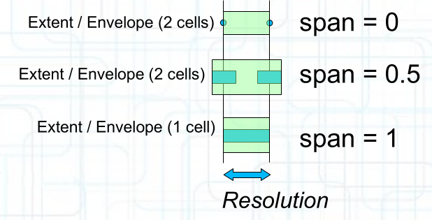
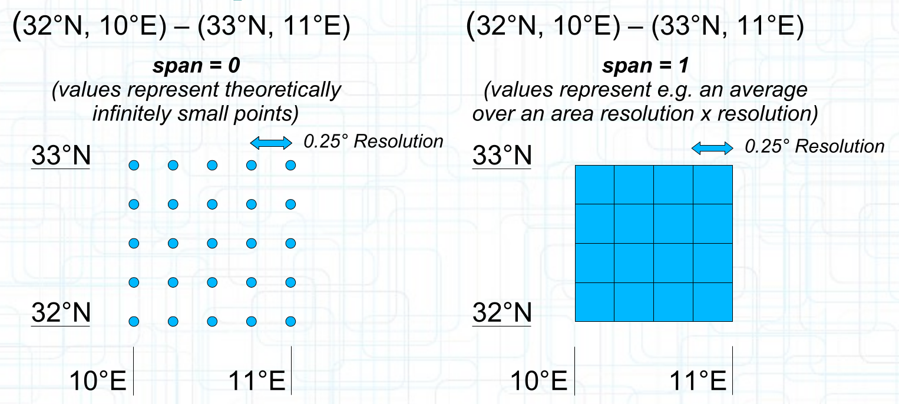

[[rc_core]]
== Requirements Class "Core"

=== Overview

The "Core" Requirement Class of the _Coverages API_ defines the mandatory requirements for any implementation of a Web API claiming conformance with this _OGC API - Coverages_ standard.
All other requirement classes are optional.

The requirement class depends on _OGC API - Common - Part 2: Geospatial data_, which defines how to list available collections of geospatial data and associate access mechanisms for these collections.

This _Coverages API_ is presented as one such access mechanism for collections of geospatial data which can be modeled as a coverage, defined
a function returning homogeneous values for any direct position part of its domain.

This requirement class extends the `/collections` and `/collections/{collectionId}` resources defined by _OGC API - Common - Part 2_ with additional information for collections accessible using this _Coverages API_.
Each collection accessible as a coverage needs to include a link to the `/collections/{resourceId}/coverage` resource using the `[ogc-rel:coverage]` link relation type, which is used to retrieve the coverage data.

Each collection must also include a link to the `/collections/{collectionId}/schema` resource, using the `[ogc-rel:schema]` relation type, providing a schema of the fields of the coverage supporting a JSON Schema representation.
This schema provides equivalent functionality to the Coverage Implementation Schema (CIS) _range type_, including for each field
(the measured or observed property, such as a satellite imagery band, or sea surface temperature) an identifier (the property key), a `title`, a `description`, and a JSON Schema `type`.
Semantic annotations may also be included providing additional useful information.

The `extent` property of the collection description is also restricted to use a uniform schema for additional dimensions beyond spatial and temporal.
As with the `temporal` dimension, and similar to the `bbox` of the `spatial` dimension, each additional dimension must include an `interval` property to specify at minimum the overall envelope of the dimension, and optionally sub-intervals where data is available, if the overall interval is sparsely populated.
A `grid` property for these dimensions also allows describing the `cellsCount` of the grid, as well as a cell `resolution` for regular grids, or a list of individual `coordinates` for irregular grids using.
This extent information provides equivalent information to the CIS _domain set_ for most use cases.
For point cloud data, a separate detailed description of the domain is not practical, and a subset of the domain is instead retrieved together with the data, as with the common LAS and LASzip point cloud encodings.
In this case, only the overall interval, and optionally detailed sub-intervals where data is available, can be provided instead within the collection extent.

When describing the extent of a coverage, the geometry of the cells must be considered.

[#span-extent,reftext='{figure-caption} {counter:fig-num}']
.The span of a gridded coverage for _Value-is-Point_ (span = 0) and _Value-is-Area_ (span = 1), and a special case of _Value-is-Part-of-the-Area_ (span = 0.5)

The multidimensional extent being described is the extent of the coverage up to the boundary of the geometry of the cells.

[#span,reftext='{figure-caption} {counter:fig-num}']
.Example extent of a gridded coverage for _Value-is-Point_ (span = 0) and _Value-is-Area_ (span = 1)

The reported extent (the CRS84 `bbox` and/or the native CRS `storageCrsBbox` in the spatial extent, and the interval bounds in the temporal and/or any additional dimensions of the extent) must correspond to the envelope of the geometry of all cells.
For cells representing an area, the extent spans from the lower to the upper bounds of the areas of all those cells.
For cells representing a point, the extent spans from the the lower to the upper coordinate of all those cells.

For gridded coverages, considering the lower and upper bound specified in the interval / bounding box as well as the `cellsCount` and `resolution` specified in the `grid` property, the following applies.

If cell values represent an area, `cellsCount = (highBound - lowBound) / resolution`.

If cell values represent a point, `cellsCount = (highBound - lowBound) / resolution + 1`.

include::requirements/requirements_class_core.adoc[]
