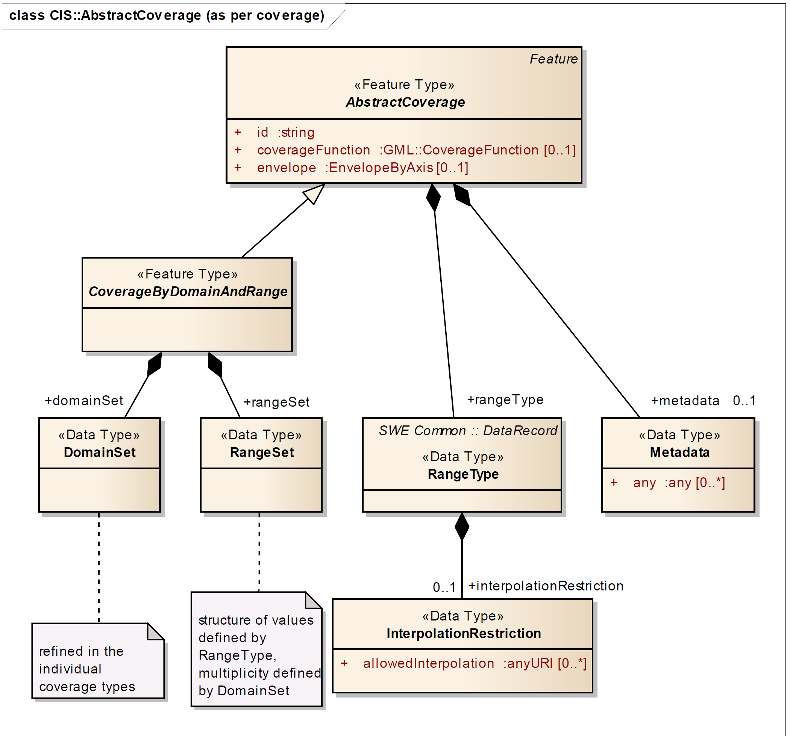

== Requirements Class "Core"

[[core-overview]]
=== Overview

include::requirements/requirements_class_core.adoc[]

The OGC API family of standards is organized by resource type. OGC API - Coverages specifies the fundamental API building blocks for interacting with coverages. The spatial data community uses the term 'coverage' for homogeneous collections of values located in space/time, such as spatio-temporal sensor, image, simulation, and statistics data.

If you are unfamiliar with the term 'coverage', the explanations on the http://myogc.org/go/coveragesDWG[Coverages DWG Wiki] provide more detail and links to educational material. Additionally, https://www.w3.org/TR/sdw-bp/#coverages[Coverages: describing properties that vary with location (and time)] in the W3C/OGC Spatial Data on the Web Best Practice document may be considered.

This https://github.com/opengeospatial/ogc_api_coverages[OGC API - Coverages] specification establishes how to access coverages as defined by the http://docs.opengeospatial.org/is/09-146r6/09-146r6.html[Coverage Implementation Schema (CIS) 1.1] through Web APIs. A high-level view of the CIS data model is provided in <<abstract-coverage-figure>>.

[#abstract-coverage-figure,reftext='{figure-caption} {counter:fig-num}']
.Abstract Coverage

This `Core` Requirements Class defines the requirements for locating, understanding, sub-setting, and accessing coverage resources. However, it does not specify any formats for the returned resources. The formats available to implementors of this standard are specified in additional Requirements Classes.

[[dependencies]]
=== Dependencies

The OGC API-Coverages standard is an extension of the OGC API-Common standard. Therefore, an implementation of API-Coverages must first satisfy the appropriate Requirements Classes from API-Common.

include::requirements/core/REQ_api-common.adoc[]

<<mapping-to-common>> Identifies the API-Common Requirements Classes which are applicable to each section of this Standard. Instructions on when and how to apply these Requirements Classes are provided in each section.

[#mapping-to-common,reftext='{table-caption} {counter:table-num}']
.Mapping API-Coverages Sections to API-Common Requirements Classes
[width="90%",cols="2,6"]
|====
^|*API-Coverage Section* ^|*API-Common Requirements Class*
|<<landing-page,API Landing Page>>| http://www.opengis.net/spec/ogcapi_common/1.0/req/core
|<<api-definition,API Definition>>| http://www.opengis.net/spec/ogcapi_common/1.0/req/core
|<<conformance-classes,Declaration of Conformance Classes>>| http://www.opengis.net/spec/ogcapi_common/1.0/req/core
|<<collections,Collections>>| http://www.opengis.net/spec/ogcapi_common/1.0/req/collections
|<<collections,OpenAPI 3.0>>| http://www.opengis.net/spec/ogcapi_common/1.0/req/oas30
|<<collections,GeoJSON>>| http://www.opengis.net/spec/ogcapi_common/1.0/req/geojson
|<<collections,HTML>>| http://www.opengis.net/spec/ogcapi_common/1.0/req/html
|====

[[path-summary]]
=== Path Summary

Resources exposed through an OGC API may be accessed through a Universal Resource Identifier <<rfc3986,(URI).>> URIs are composed of three sections:

* Service Offering: The service endpoint (subsequently referred to as Base URI or {root})
* Access Paths: Unique paths to Resources
* Query: Parameters to adjust the representation of a Resource or Resources like encoding format or subsetting

Alternately, most resources are also accessible through links on previously accessed resources. Unique relation types are used for each resource.

<<coverage-paths>> summarizes the access paths and relation types defined in this standard.

[#coverage-paths,reftext='{table-caption} {counter:table-num}']
.Coverage API Paths
[width="90%",cols="2,^1,4",options="header"]
|===
^|**Path Template** ^|**Relation** ^|**Resource**
3+^|**Common**
|<<landing-page,{root}/>> |none |Landing page
|<<api-definition,{root}/api>> |`service-desc` +
or +
`service-doc` |API Description (optional)
|<<conformance-classes,{root}/conformance>> |`conformance` |Conformance Classes
|<<collections,{root}/collections>> |`data` |Metadata describing the spatial collections (coverages) available from this API.
|<<collectionInfo,{root}/collections/{coverageId}>> | |Metadata describing the coverge which has the unique identifier `{coverageId}`
3+^|**Coverages**
|<<coverage-clause,{root}/collections/{coverageId}/coverage>> |`items` |A general description of the coverage identified by {coverageId} including the coverage's envelope.
|<<coverage-description-clause,{root}/collections/{coverageId}/coverage/description>> |tbd |returns the whole coverage description consisting of domainset, rangetype, and metadata (but not the rangeset)
|<<coverage-domainset-clause,{root}/collections/{coverageId}/coverage/domainset>> |tbd |returns the coverage's domain set definition
|<<coverage-rangetype-clause,{root}/collections/{coverageId}/coverage/rangetype>> |tbd |returns the coverage's range type information (i.e., a description of the data semantics)
|<<coverage-metadata-clause,{root}/collections/{coverageId}/coverage/metadata>> |tbd |returns the coverage's metadata (may be empty)
|<<coverage-rangeset-clause,{root}/collections/{coverageId}/coverage/rangeset>> |tbd |returns the coverage's range set, i.e., the actual values in the coverage's Native Format (see format encoding for ways to retrieve in specific formats)
|<<coverage-all-clause,{root}/collections/{coverageId}/coverage/all>> |tbd |returns all of the above namely the coverage's domainset, rangetype, metadata, and rangeset comparable to a GetCoverage response
|===

Where:

* {root} = Base URI for the API server
* {coverageId} = an identifier for a specific coverage (collection)

[[api-platform]]
=== Platform

API-Common defines a set of common capabilities which are applicable to any OGC Web API. Those capabilities provide the platform upon which resource-specific APIS can be built. This section describes those capabilities and any modifications needed to better support Coverage resources.

[[landing-page]]
==== API landing page

The landing page provides links to start exploring the resources offered by an API. Its most important component is a list of links. OGC API-Common already requires some common links. Those links are sufficient for this standard.

.Dependencies
[width="90%"]
|====
|http://www.opengis.net/spec/ogcapi_common-1/1.0/req/core
|====

===== Operation

The `Landing Page` operation is defined in the `Core` conformance class of API-Common. No modifications are needed to support `Coverage` resources. The `Core` conformance class specifies only one way of performing this operation:

. Issue a `GET` request on the `{root}/` path

Support for `GET` on the `{root}/` path is required by API-Common.

===== Response

A successful response to the `Landing Page` operation is defined in API-Common. The schenma for this resource is provided in <<landingPage-schema>>.

include::requirements/core/REQ_root-success.adoc[]

[#landingPage-schema,reftext='Landing Page Response Schema']
.Landing Page Response Schema
[source,yaml]
----
include::openapi/schemas/common/landingPage.yaml[]
----

The following JSON fragment is an example of a response to an OGC API-Coverages Landing Page operation.

[#landingPage-example,reftext=`Landing Page Example`]
.Landing Page Example
[source,json]
----
include::examples/JSON/landingPage_example.json[]
----

===== Error situations

The requirements for handeling unsuccesful requests are provided in <<http-response>>. General guidance on HTTP status codes and how they should be handeled is provided in <<http-status-codes>>.

[[api-definition]]
==== API definition

Every API is required to provide a definition document that describes the capabilities of that API. This definition document can be used by developers to understand the API, by software clients to connect to the server, or by development tools to support the implementation of servers and clients.

.Dependencies
[width="90%"]
|====
|http://www.opengis.net/spec/ogcapi_common-1/1.0/req/core
|====

===== Operation

This operation is defined in the `Core` conformance class of API-Common. No modifications are needed to support `Coverage` resources. The `Core` conformance class describes two ways of performing this operation:

. Follow the `{root}/api` path
. Follow the `service-desc` or `service-doc` link on the landing page

Only the link is required by API-Common.

===== Response

A successful response to the API Definition request is a resource which documents the design of the API. API-Common leaves the selection of format for the API Definition response to the API implementor. However, the options are limited to those which have been defined in the API-Common standard. At this time OpenAPI 3.0 is the only option provided.

===== Error situations

The requirements for handeling unsuccesful requests are provided in <<http-response>>. General guidance on HTTP status codes and how they should be handeled is provided in <<http-status-codes>>.

[[conformance-classes]]
==== Declaration of conformance classes

To support "generic" clients that want to access multiple OGC API standards and extensions - and not "just" a specific API / server, the API has to declare the conformance classes it claims to have implemented.

.Dependencies
[width="90%"]
|====
|http://www.opengis.net/spec/ogcapi_common-1/1.0/req/core
|====

===== Operation

This operation is defined in the `Core` conformance class of API-Common. No modifications are needed to support `Coverage` resources. The `Core` conformance class describes two ways of performing this operation:

. Follow the `{root}/conformance` path
. Follow the `conformance` link on the landing page

Both techniques are required by API-Common.

===== Response

A successful response to the Conformance operation is a list of URLs. Each URL identifies an OGC Conformance Class for which this API claims conformance. The schema for this resource is defined in API-Common and provided for reference in <<conformance-schema>>.

include::requirements/core/REQ_core_conformance.adoc[]

[#conformance-schema,reftext='Conformance Response Schema']
.Conformance Response Schema
[source,yaml]
----
include::openapi/schemas/common/confClasses.yaml[]
----

The following JSON fragment is an example of a response to an OGC API-Coverages conformance operation.

[#conformance-example,reftext=`Conformance Information Example`]
.Conformance Information Example
[source,json]
----
include::examples/JSON/conformance_example.json[]
----

===== Error situations

The requirements for handeling unsuccesful requests are provided in <<http-response>>. General guidance on HTTP status codes and how they should be handeled is provided in <<http-status-codes>>.

=== Coverage Access Paths

In this clause, API-Common is extended to support `Coverage` resources. 

API-Common starts with the assumption that spatial resources are orgainzed into collections. An API will expose one or more collections. The API-Common Collections Conformance Class defines how to organize and provide access to a collection of collections.

API-Coverages observes that a coverage is a collection of measured values. Therefore, a coverage is a collection. 

This standard extends the API-Common `Collections` conformance class to support collections of coverages, then extends that class to support `Coverage` unique capabilties.

[[collections]]
==== Collections

The `Collections` operation returns a set of metadata which describes the collections available from this API. Each collection on a Coverages API will be a coverage.

.Dependencies
[width="90%"]
|====
|http://www.opengis.net/spec/ogcapi_common-1/1.0/req/collections
|====

===== Operation

This operation is defined in the `Collections` conformance class of API-Common. No modifications are needed to support `Coverage` resources. The `Collections` conformance class describes two ways of performing this operation:

. Follow the `{root}/collections` path
. Follow the `data` link on the landing page

Support for both the `{root}/collections` path and the `data` link is required by API-Common.

===== Response

A successful response to the `Collections Operation` is a document which includes summary metadata for each collection accessible though the API. 

[#collections-schema,reftext='Collections Response Schema']
.Collections Response Schema
[source,yaml]
----
include::openapi/schemas/common/collections.yaml[]
----

The following JSON fragment is an example of a response to an OGC API-Coverages Collections operation.

[#conllections-example,reftext=`Collections Example`]
.Collections Example
[source,json]
----
include::examples/JSON/collections_example.json[]
----

===== Error situations

The requirements for handeling unsuccesful requests are provided in <<http-response>>. General guidance on HTTP status codes and how they should be handeled is provided in <<http-status-codes>>.

[[collectionInfo]]
==== Collection Information

Collection Information is the set of metadata which describes a single collection, or in the the case of API-Coverages, a single Coverage. An abreviated copy of this information is returned for each Coverage in the /Collections response.   

.Dependencies
[width="90%"]
|====
|http://www.opengis.net/spec/ogcapi_common-1/1.0/req/collections
|====

===== Operation

This operation is defined in the `Collections` conformance class of API-Common. No modifications are required to support `Coverage` resources. However, on a coverages API the the collections are also coverages. So in this standard the term `coverageId` is used instead of `collectionId`. The two terms are equivalent. 

The `Collections` conformance class describes one way of performing this operation:

. Follow the `{root}/collections/{coverageId}` path
 
The {coverageId} parameter is the unique identifier for a single coverage on the API. The list of valid values for {coverageId} is provided in the /collections response. 

Support for both the `/collections/{coverageId}` path is required by API-Common.

===== Response

A successful response to the Collection Operation is a set of metadata which describes the collection identified by the {coverageId} parameter. 

[#collectionInfo-schema,reftext='Collection Information Response Schema']
.Collection Information Response Schema
[source,yaml]
----
include::openapi/schemas/common/collectionInfo.yaml[]
----

The following JSON fragment is an example of a response to an OGC API-Coverages Collection Information operation.

[#collection-info-example,reftext=`Collection Information Example`]
.Collection Information Example
[source,json]
----
include::examples/JSON/collection_info_example.json[]
----

===== Error situations

The requirements for handeling unsuccesful requests are provided in <<http-response>>. General guidance on HTTP status codes and how they should be handeled is provided in <<http-status-codes>>.

=== Coverage Access

This section is about coverage access, which is driven by the coverage structure.

The paths discussed in this section are all branches off of the `/collections/{coverageId}` root.

[[coverage-clause]]
==== Coverage Offering

The `Coverage Offering` operation returns a general coverage offering description consisting of envelope, rangetype, and service metadata such as the coverage's native format

===== Operation

The `Coverage Offering` operation is defined by the following requirement. 

include::requirements/core/REQ_cov-offer-op.adoc[]

===== Response

A successful response to the `Coverage Offering` operation shall meet the following requirement.

include::requirements/core/REQ_cov-offer-success.adoc[]

[#coverage-schema,reftext='Coverage Offering Response Schema']
.Coverage Offering Response Schema
[source,yaml]
----
include::openapi/schemas/coverage_offering.yaml[]
----

The following JSON fragment is an example of a response to a Coverage Offering request.

[#coverage-offering-example,reftext=`Coverage Offering Example`]
.Coverage Offering Example
[source,json]
----
include::examples/JSON/coverage_offering_example.json[]
----

===== Error situations

The requirements for handeling unsuccesful requests are provided in <<http-response>>. General guidance on HTTP status codes and how they should be handeled is provided in <<http-status-codes>>.

[[coverage-description-clause]]
==== Coverage Description

The `Coverage Description` operation returns the whole coverage description consisting of domainset, rangetype, and metadata (but not the rangeset)

===== Operation

The `Coverage Description` operation is defined by the following requirement. 

include::requirements/core/REQ_cov-desc-op.adoc[]

===== Response

A successful response to the `Coverage Description` operation shall meet the following requirement.

include::requirements/core/REQ_cov-desc-success.adoc[]

[#coverage-description-schema,reftext='Coverage Description Response Schema']
.Coverage Description Response Schema
[source,yaml]
----
include::openapi/schemas/coverage_description.yaml[]
----

The following JSON fragment is an example of a response to a Coverage Description request.

[#coverage-description-example,reftext=`Coverage Description Example`]
.Coverage Description Example
[source,json]
----
include::examples/JSON/coverage_description_example.json[]
----

===== Error situations

The requirements for handeling unsuccesful requests are provided in <<http-response>>. General guidance on HTTP status codes and how they should be handeled is provided in <<http-status-codes>>.

[[coverage-domainset-clause]]
==== Coverage Domain Set

The `Coverage Domain Set` operation returns the coverage’s domain set definition

===== Operation

The `Coverage Domain Set` operation is defined by the following requirement. 

include::requirements/core/REQ_cov-ds-op.adoc[]

===== Response

A successful response to the `Coverage Domain Set` operation shall meet the following requirement.

include::requirements/core/REQ_cov-ds-success.adoc[]

[#coverage-domainset-schema,reftext='Coverage Domain Set Response Schema']
.Coverage Domain Set Response Schema
[source,yaml]
----
include::openapi/schemas/coverage_domainset.yaml[]
----

The following JSON fragment is an example of a response to a Coverage DomainSet request.

[#coverage-domainset-example,reftext=`Coverage DomainSet Example`]
.Coverage DomainSet Example
[source,json]
----
include::examples/JSON/coverage_domainset_example.json[]
----

===== Error situations

The requirements for handeling unsuccesful requests are provided in <<http-response>>. General guidance on HTTP status codes and how they should be handeled is provided in <<http-status-codes>>.

[[coverage-rangetype-clause]]
==== Coverage Range Type

The `Coverage Range Type` operation returns the coverage’s range type information (i.e., a description of the data semantics)

===== Operation

The `Coverage Range Type` operation is defined by the following requirement. 

include::requirements/core/REQ_cov-rt-op.adoc[]

===== Response

A successful response to the `Coverage Range Type` operation shall meet the following requirement.

include::requirements/core/REQ_cov-rt-success.adoc[]

[#coverage-rangetype-schema,reftext='Coverage Range Type Response Schema']
.Coverage Range Type Response Schema
[source,yaml]
----
include::openapi/schemas/coverage_rangetype.yaml[]
----

The following JSON fragment is an example of a response to a Coverage RangeType request.

[#coverage-rangetype-example,reftext=`Coverage RangeType Example`]
.Coverage RangeType Example
[source,json]
----
include::examples/JSON/coverage_rangetype_example.json[]
----

===== Error situations

The requirements for handeling unsuccesful requests are provided in <<http-response>>. General guidance on HTTP status codes and how they should be handeled is provided in <<http-status-codes>>.

[[coverage-rangeset-clause]]
==== Coverage Range Set

The `Coverage Range Set` operation returns the coverage’s range set, i.e., the actual values in the coverage’s Native Format (see format encoding for ways to retrieve inspecific formats)

===== Operation

The `Coverage Range Set` operation is defined by the following requirement. 

include::requirements/core/REQ_cov-rs-op.adoc[]

===== Response

A successful response to the `Coverage Range Set` operation shall meet the following requirement.

include::requirements/core/REQ_cov-rs-success.adoc[]

[#coverage-rangeset-schema,reftext='Coverage Range Set Response Schema']
.Coverage Range Set Response Schema
[source,yaml]
----
include::openapi/schemas/coverage_rangeset.yaml[]
----

The following JSON fragment is an example of a response to a Coverage RangeSet request.

[#coverage-rangeset-example,reftext=`Coverage RangeSet Example`]
.Coverage RangeSet Example
[source,json]
----
include::examples/JSON/coverage_rangeset_example.json[]
----

===== Error situations

The requirements for handeling unsuccesful requests are provided in <<http-response>>. General guidance on HTTP status codes and how they should be handeled is provided in <<http-status-codes>>.

[[coverage-metadata-clause]]
==== Coverage Metadata

The `Coverage Metadata` operation returns the coverage’s metadata (may be empty)

===== Operation

The `Coverage Metadata` operation is defined by the following requirement. 

include::requirements/core/REQ_cov-md-op.adoc[]

===== Response

A successful response to the `Coverage Metadata` operation shall meet the following requirement.

include::requirements/core/REQ_cov-md-success.adoc[]

[#coverage-metadata-schema,reftext='Coverage Metadata Response Schema']
.Coverage Metadata Response Schema
[source,yaml]
----
include::openapi/schemas/coverage_metadata.yaml[]
----

The following JSON fragment is an example of a response to a Coverage Metadata request.

[#coverage-metadata-example,reftext=`Coverage Metadata Example`]
.Coverage Metadata Example
[source,json]
----
include::examples/JSON/coverage_metadata_example.json[]
----

===== Error situations

The requirements for handeling unsuccesful requests are provided in <<http-response>>. General guidance on HTTP status codes and how they should be handeled is provided in <<http-status-codes>>.

[[coverage-all-clause]]
==== Coverage All

The `Coverage All` operation returns all of the above namely the coverage’s domainset, rangetype, meatadata, and rangeset comparable to a GetCoverage response

===== Operation

The `Coverage All` operation is defined by the following requirement. 

include::requirements/core/REQ_cov-all-op.adoc[]

===== Response

A successful response to the `Coverage All` operation shall meet the following requirement.

include::requirements/core/REQ_cov-all-success.adoc[]

[#coverage--schema,reftext='Coverage Response Schema']
.Coverage Response Schema
[source,yaml]
----
include::openapi/schemas/coverage_all.yaml[]
----

The following JSON fragment is an example of a response to a Coverage All request.

[#coverage-all-example,reftext=`Coverage All Example`]
.Coverage All Example
[source,json]
----
include::examples/JSON/coverage_all_example.json[]
----

===== Error situations

The requirements for handeling unsuccesful requests are provided in <<http-response>>. General guidance on HTTP status codes and how they should be handeled is provided in <<http-status-codes>>.

[[parameters-section]]
=== Parameters
The API-Coverages standard inherits basic query and subsetting parameters from API-Common. This section provides a short description of each parameter and identifies the relevant requirements.

All of the permissions and recommendations in API-Common regarding the these parameters also apply to API-Coverages implementations.

==== Parameter bbox

The Bounding Box (bbox) parameter is defined in API-Common. The following requirement governs use of that parameter in a Coverage API.  

include::requirements/core/REQ_cov-bbox-parameter.adoc[]

==== Parameter datetime

The Date-Time (datetime) parameter is defined in API-Common. The following requirement governs use of that parameter in a Coverage API.  

include::requirements/core/REQ_cov-datetime-parameter.adoc[]

==== Parameter Limit

The Limit (limit) parameter is defined in API-Common. The following requirement governs use of that parameter in a Coverage API.  

include::requirements/core/REQ_cov-limit-parameter.adoc[]

==== Combinations of Filter Parameters

Any combination of `bbox`, `datetime` and 
parameters for filtering on coverage properties is allowed. Note that the requirements on these parameters imply that only coverages matching all the predicates are in the result set; i.e., the logical operator between the predicates is 'AND.'

==== Paged Response

One consequence of the Limit parameter is that the full result set is not delivered to the user. However, users frequently want to know how big the result set it and how to access the rest of it. The following requirement add information to the response to address that need.

include::requirements/core/REQ_cov-paged-response.adoc[]

[[general-section]]
=== General

[[http-response]]
==== HTTP Response
Each HTTP request shall result in a response that meets the following requirement.

include::requirements/core/REQ_http-response.adoc[]

The YAML schema for these results is provided in <<http-response-schema>>.

[#http-response-schema,reftext='HTTP Response Schema']
.HTTP Response Schema
[source,yaml]
----
include::openapi/schemas/common/exception.yaml[]
----

[[http-status-codes]]
==== HTTP status codes

The *Status Codes* listed in <<status_codes>> are of particular relevance to implementors of this standard. Status codes 200, 400, and 404 are called out in API requirements. Therefore, support for these status codes is mandatory for all compliant implementations. The remainder of the status codes in <<status_codes>> are not mandatory, but are important for the implementation of a well functioning API. Support for these status codes is strongly encouraged for both client and server implementations.

[#status_codes,reftext='{table-caption} {counter:table-num}']
.Typical HTTP status codes[[table_2]]
[cols="15,85",options="header"]
!===
|Status code |Description
|`200` |A successful request.
|`304` |An <<web_caching,entity tag was provided in the request>> and the resource has not been changed since the previous request.
|`400` |The server cannot or will not process the request due to an apparent client error. For example, a query parameter had an incorrect value.
|`401` |The request requires user authentication. The response includes a `WWW-Authenticate` header field containing a challenge applicable to the requested resource.
|`403` |The server understood the request, but is refusing to fulfill it. While status code `401` indicates missing or bad authentication, status code `403` indicates that authentication is not the issue, but the client is not authorised to perform the requested operation on the resource.
|`404` |The requested resource does not exist on the server. For example, a path parameter had an incorrect value.
|`405` |The request method is not supported. For example, a POST request was submitted, but the resource only supports GET requests.
|`406` |The `Accept` header submitted in the request did not support any of the media types supported by the server for the requested resource.
|`500` |An internal error occurred in the server.
!===

More specific guidance is provided for each resource, where applicable.

The API Description Document describes the HTTP status codes generated by that API. This should not be an exhaustive list of all possible status codes. It is not reasonable to expect an API designer to control the use of HTTP status codes which are not generated by their software. Therefore, it is recommended that the API Description Document limit itself to describing HTTP status codes relevant to the proper operation of the API application logic. Client implementations should be prepared to receive HTTP status codes in addition to those described in the API Description Document.

include::recomendations/core/PER_additional-status-codes.adoc[]

