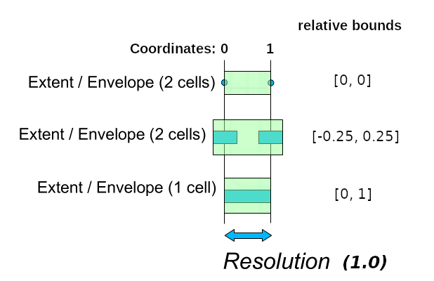
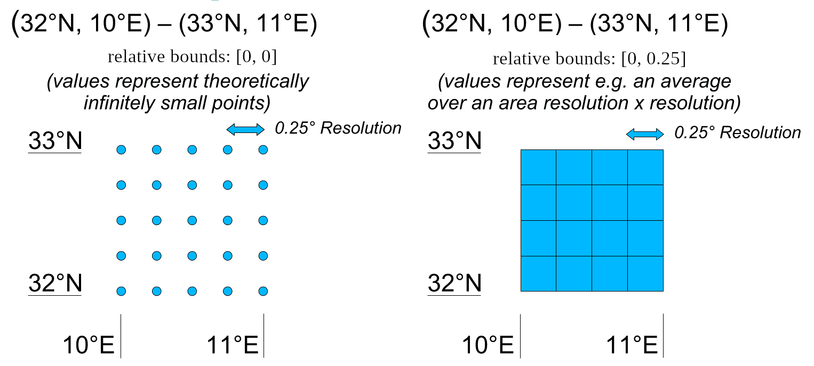

[[rc_core]]
== Requirements Class "Core"

=== Overview

The "Core" Requirement Class of the _Coverages API_ defines the mandatory requirements for any implementation of a Web API claiming conformance with this _OGC API - Coverages_ standard.
All other requirement classes are optional.

The requirement class depends on _OGC API - Common - Part 2: Geospatial data_, which defines how to list available collections of geospatial data and associate access mechanisms for these collections.

The only strict depedency from _OGC API - Common - Part 1: Core_ for this Standard is the "Core" requirements class, which simply defines the shared principles of OGC APIs.
However, implementations are strongly encouraged to also implement the "Landing Page" requirements class from OGC API - Common - Part 1 which specifies a resource (`/conformance`), for declaring conformance to
the requirements classes they support, making clients and test suites aware of the supported capabilities of the API.
The "Landing Page" requirements class additionally requires providing a definition for the Web API.

This _Coverages API_ is presented as one such access mechanism for collections of geospatial data which can be modeled as a coverage, defined as
a function returning homogeneous values for any direct position part of its domain.

This requirement class depends on the https://docs.ogc.org/DRAFTS/20-024.html#rc-collections-section[_collections_ requirements class] of _OGC API - Common - Part 2_ which defines
the `/collections` and `/collections/{collectionId}` resources, as well as its https://docs.ogc.org/DRAFTS/20-024.html#rc-umd-collection-section[_uniform multi-dimension collection_ requirements class].
introducing additional requirements standardizing the description of multidimensional data cubes and gridded data.
Each collection accessible as a coverage needs to include a link to the `/collections/{resourceId}/coverage` resource using the `[ogc-rel:coverage]` link relation type, which is used to retrieve the coverage data.

==== Description of the coverage fields

Each collection must also include a link to the `/collections/{collectionId}/schema` resource, using the `[ogc-rel:schema]` relation type, providing a schema of the fields of the coverage supporting a JSON Schema representation,
as defined in https://docs.ogc.org/is/23-058r2/23-058r2.html[_OGC API Common - Part 3: Schemas_].
This schema provides equivalent functionality to the Coverage Implementation Schema (CIS) _range type_, including for each field
(the measured or observed property, such as a satellite imagery band, or sea surface temperature) an identifier (the property key), a `title`, a `description`, and a JSON Schema `type`.
Semantic annotations such as the https://docs.ogc.org/is/23-058r2/23-058r2.html#_ordering_properties[sequence number of the field], https://docs.ogc.org/is/23-058r2/23-058r2.html#_special_null_values[special null values],
a definition URI (see https://docs.ogc.org/is/23-058r2/23-058r2.html#_semantic_definition_of_a_property[Semantic definition of a property]),
https://docs.ogc.org/is/23-058r2/23-058r2.html#_the_unit_of_measure_for_a_numeric_property[units] describing the nature of each field in a machine-readable way,
or a <<req_core-coverage_fields_schema, resolution specific to a particular field>> should also be included.
<<schemas-field-annotation>> summarizes the JSON Schema extensions for annotating fields defined by OGC API - Common - Part 3
as well as those introduced in this Standard.

[#schemas-field-annotation,reftext='{table-caption} {counter:table-num}']
.Schemas field annotations
[cols="1,1"]
|===
|Keyword                | Description

2+| _Introduced in Common - Part 3 / Features - Part 5: Schemas_
| https://docs.ogc.org/is/23-058r2/23-058r2.html#req_schemas_role[*x-ogc-role*]
| Role of a property (e.g., ID, primary geometry/time, reference)

| https://docs.ogc.org/is/23-058r2/23-058r2.html#req_schemas_property-seq[*x-ogc-propertySeq*]
| Sequential order of a property (e.g. for CSV, GeoTIFF)

| https://docs.ogc.org/is/23-058r2/23-058r2.html#req_schemas_unit[*x-ogc-unit*]
| Unit of measure (by default in UCUM; URI if unitLang is QUDT)

| https://docs.ogc.org/is/23-058r2/23-058r2.html#req_schemas_unit[*x-ogc-unitLang*]
| Alternate language for unit (e.g., QUDT)

| https://docs.ogc.org/is/23-058r2/23-058r2.html#req_schemas_definition[*x-ogc-definition*]
| Semantic definition (e.g., QUDT https://qudt.org/vocab/quantitykind/AtmosphericPressure)

| https://docs.ogc.org/is/23-058r2/23-058r2.html#req_references_role-reference[*x-ogc-collectionId*]
| A collection ID e.g., if role is reference (NOTE: can be an array)

| https://docs.ogc.org/is/23-058r2/23-058r2.html#req_references_role-reference[*x-ogc-uriTemplate*]
| A URI template (e.g., as a way to reference a feature with a `{featureId}` template)

| https://docs.ogc.org/is/23-058r2/23-058r2.html#_special_null_values[*x-ogc-nullValues*]
| Values considered null, but which for some reason are represented by a value in the value domain of the data type of the property.

| https://docs.ogc.org/is/23-058r2/23-058r2.html#req_profile-codelists_codelist-ref[*x-ogc-codelistUri*]
| A reference to a codelist.

2+| _Introduced in this Standard_

| <<rec_core_coverage-schema-variable-type, *x-ogc-variableType*>>
| The type of variable (`continuous`, `categoricalOrdinal`, `categoricalNominal`, `numericalOrdinal`, `numericalNominal`), which notably provides context about proper <<conventions-interpolation-methods, interpolation methods>> (see also https://docs.ogc.org/DRAFTS/20-024.html#conceptual-model[Common - Part 2 UML Diagram])

| <<req_core-coverage_fields_schema, *x-ogc-resolution*>>
| Resolution for each dimension (in units of the dimension) applying to this particular field (e.g., higher panchromatic band resolution, lower scene classification layer)

| *x-ogc-statistics*
a| An object with statistics for this field: `min`, `max`, `avg`, `stdDev`.
For example:
[source,json]
----
   "Elevation": {
      "type": "number",
      "x-ogc-propertySeq": 1,
      "x-ogc-definition": "https://vocab.nerc.ac.uk/standard_name/height_above_reference_ellipsoid",
      "x-ogc-unit": "m",
      "x-ogc-statistics": {
         "min": -10920.0,
         "max": 8826.0,
         "avg": -2440.0,
         "stdDev": 2400.0
      }
   }
----

| *x-ogc-observingProcedure*
| A workflow, protocol, plan, algorithm, or technique specifying how to execute an observation
| *x-ogc-observer*
| The active entity—such as a sensor, device, algorithm, or person—that executes the observing procedure to estimate the value of an observed property
| *x-ogc-featureOfInterest*
| The real-world entity whose property is being observed and estimated
| *x-ogc-platform*
| An entity that hosts other entities, such as sensors, actuators, samplers, or other platforms

|===

==== Description of the coverage domain

The uniform multi-dimension collection requirements class restricts the addition of dimensions beyond spatial and temporal to the `extent` property of the collection description to use a uniform schema.
As with the `temporal` dimension, and similar to the `bbox` of the `spatial` dimension, each additional dimension must include an `interval` property to specify at minimum the overall envelope of the dimension,
and optionally sub-intervals where data is available, if the overall interval is sparsely populated.
The nature of the additional dimensions are also specified using a semantic definition URI from a suitable semantic vocabulary such as QUDT.
For example, a dimension could be identified as representing atmospheric pressure using the URI `https://qudt.org/vocab/quantitykind/AtmosphericPressure`.
If applicable, the unit of measure can also be specified using the case sensitive UCUM representation, or using another unit language by specifying an alternative value for `unitLang`.
For example, if `QUDT` is used, the unit can be a URI from the QUDT Units Vocabulary.
When describing the extent of a coverage, the geometry of its indivudal components, such as cells in the case of a gridded coverage, must be considered.

The native CRS of the data is specified in the `storageCrs` property of the collection description.
For OGC API - Coverages, this native CRS usually specifies the CRS in which the data is most efficiently retrieved and
corresponds to the default output CRS (which may be overridden with a `crs` query parameter if the implementation supports the "Coordinate Reference System" requirements class).
Note that this native CRS is not necessarily how the data is stored internally, as in some use cases different parts of the coverage
might actually be stored in different CRSs (e.g., one per UTM zone), while a CRS like `[OGC:CRS84]` allows to provide the entire coverage in a single unifying CRS.

The `crs` specified in the `spatial` property of the `extent` specifies only the coordinate reference system of the `bbox`, which is primarily for the purpose of discovery and identifying whether the data
spans an area of interest, and does not imply a particular native / storage CRS nor a default output CRS.
For data referenced to Earth, this `crs` will always be `[OGC:CRS84]` or `[OGC:CRS84h]`.
The `storageCrsBbox` property of the `spatial` property of the `extent` allows to specify the bounding box in the native CRS.

The `bbox`, `storageCrsBbox` and the interval bounds in the temporal and/or any additional dimensions of the extent must correspond to the extent of the geometry of the entire coverage.

For datasets with one or more temporal dimension, the primary temporal dimension is described by the `temporal` property of the extent, while additional temporal dimensions
(e.g., the time at which a forecast was calculated) would be described in additional dimensions.
All temporal dimensions need to include a `trs` or `definition` with a value set to a URI, except for the primary temporal dimension which defaults to the ISO-8601 Gregorian calendar date and time if none is specified.
For the `trs`, URI should identify a temporal reference system, whereas for `definition`, the URI should identify the semantic definition of the temporal dimension, and can optionally be accompanied by a `unit`.

For data where the Gregorian calendar and ISO-8601 notation is applicable to the time scale, the `trs` property would be used and set to `https://www.opengis.net/def/crs/OGC/0/GregorianDateTime`,
(or `https://www.opengis.net/def/uom/ISO-8601/0/Gregorian` for compatibility with OGC API - Features).
For other temporal scales such as geological time, the `definition` property would be used and set to a different URI such as `https://qudt.org/vocab/quantitykind/Time`.
The `unit` can also be specified e.g., `https://qudt.org/vocab/unit/MegaYR` for millions of years, with `unitLang` set to "QUDT" (or otherwise using the default UCUM unit language, simply setting `"unit": "Ma"`).

The extent of each component of a coverage for which values can be retrieved, such as a cell in the context of a gridded coverage, should consider the full _region of validity_ or _bounds_ of that component
to which these values are associated.
For example, in the case of a gridded coverage whose cells represent an area, the extent spans from the lower to the upper bounds of the areas of all those cells.
In the case of a gridded coverage whose cells represent a point, the extent spans from the the lower to the upper coordinate of all those cells.

With the ability to describe grids as detailed below, this collection extent information provides equivalent information to the CIS _domain set_ for most use cases.
For point cloud data, a separate detailed description of the domain is not practical, and a subset of the domain is instead retrieved together with the data, as with the common LAS and LASzip point cloud encodings.
In this case, only the overall interval, and optionally detailed sub-intervals where data is available, can be provided instead within the collection extent.

[#span-extent,reftext='{figure-caption} {counter:fig-num}']
.The span of a gridded coverage for _Value-is-Point_ (span = 0) and _Value-is-Area_ (span = 1), and a special case of _Value-is-Part-of-the-Area_ (span = 0.5)

The multidimensional extent being described is the extent of the coverage up to the boundary of the geometry of its individual components (such as the cells of a gridded coverage).

[#span,reftext='{figure-caption} {counter:fig-num}']
.Example extent of a gridded coverage for _Value-is-Point_ (span = 0) and _Value-is-Area_ (span = 1)

==== Description of gridded data

A `grid` property for each dimension allows describing the `cellsCount` of the grid.
For regular grids, a `firstCoordinate` as well as well as a cell `resolution` must be specified.
A set of `relativeBounds` coordinates can also be specified indicating the bounds (or region of validity) for each cell relative to `firstCoordinate + n * resolution`.

For irregular grids, a list of individual `coordinates` is used instead.
A parallel set of `boundsCoordinates` pairs can also be specified indicating the coordinates for the bounds (or region of validity) for each cell.

For regular grid coverages:

- the lower bound specified in the `bbox` or `interval` should correspond to `firstCoordinate + relativeBounds[0]`
(with `relativeBounds[0]` defaulting to `-resolution/2` if `relativeBounds` is not specified), while
- the upper bound should correspond to `firstCoordinate + cellsCount * resolution + relativeBounds[1]` (with `relativeBounds[1]` defaulting to `resolution/2` if not specified).

For cell values representing an area centered on each coordinate:

- `relativeBounds` would be set to `[-resolution / 2, resolution / 2]` (the default), and
- `cellsCount = (highBound - lowBound) / resolution`.

For cell values representing a point instead:

- `relativeBounds` would be set to `[0, 0]`, and
- `cellsCount = (highBound - lowBound) / resolution + 1`.

IMPORTANT: The resolution advertised in the `grid` property within the `extent` of the collection description refers to the grid spacing, which might differ from the resolution of the sensors or measurement
techniques used to capture the original data. This advertised resolution does not necessarily imply suitability for purpose for usage with specific resolution requirements, since
additional processing that may have already been applied to the data, or the server implementation may automatically perform to return data at that resolution
(for example, this might happen when re-projecting data with different source resolution throughout its domain, possibly because of data partitions using different CRSs such as UTM zones).

include::requirements/requirements_class_core.adoc[]
