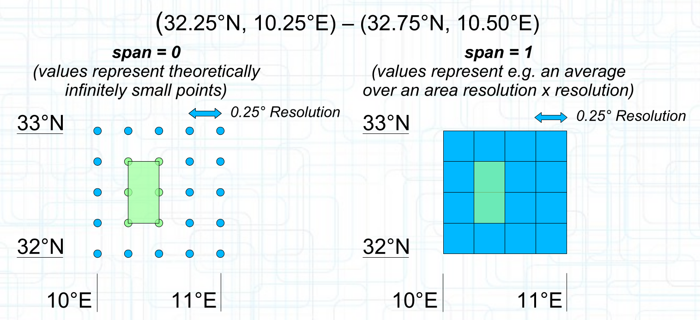
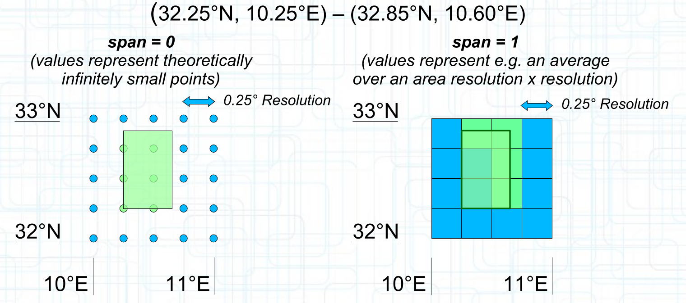

[[rc_subsetting]]
== Requirements Class "Subsetting"

=== Overview

The "Subsetting" Requirements Class specifies the `subset`, `bbox` and `datetime` parameters for the coverage resource, allowing to retrieve only a subset of the coverage along one or more dimensions.
With the `subset` and `datetime` parameters, a subset operation may be a trimming operation (preserving dimensionality) or slicing operation (reducing dimensions), depending on whether a single coordinate or an interval is used.
Negotiating a response in a format with limited multidimensionality support, such as image-based format like GeoTIFF, also implies a reduced dimensionality.

When subsetting a coverage within a lower and upper bound, a trimming operation is performed, and the response will preserve the dimension being subset.
When subsetting a coverage for a single value, a slicing operation is performed, and the response will not contain that dimension being subset.

When subsetting a coverage, the geometry of the cells must be considered.

If the value for the cells of the coverage represent an area, the geometry of the cells extends over that whole area.
If the value for the cells of the coverage represent a point, the geometry of the cells is only that infinitely small point.

The values to include in the response will be all **cells whose geometry's interior** intersects the **interior or the boundary of the subsetting extent**, in line with the https://en.wikipedia.org/wiki/DE-9IM[DE9-IM] model.

For cells whose geometry is a point, this will **include** all cells falling exactly on the boundary of the subset (**the interior of a point is the point itself**).

For cells whose geometry is an area, this will **exclude** the cells boundaries falls exactly on the boundary of the subset (**the interior of an area excludes its boundary**).

[#subset-aligned,reftext='{figure-caption} {counter:fig-num}']
.Responses for a subsetting request aligned to the coverage grid for _Value-is-Point_ (span = 0) vs. _Value-is-Area_ (span = 1)

[#subset-non-aligned,reftext='{figure-caption} {counter:fig-num}']
.Responses for a subsetting request not aligned to the coverage grid for _Value-is-Point_ (span = 0) vs. _Value-is-Area_ (span = 1)

=== Subsetting Examples

See also <<subsetting-examples, examples of subsetting requests>> in an annex.

include::requirements/requirements_class_coverage_subset.adoc[]
