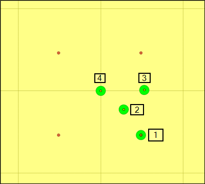

[[api-users-guide-section-1]]
=== Get Data From Point

==== Discussion 

Users might want to query a coverage for getting a data value from a 
single point. Typical use case is to check the height at given location 
from DEM but probably queries with more dimensions "temperature at 
location x,y,z at time …" make sense as well.

WCS 2.0 defines two possibilities for getting a coverage from a single point.

1.  Use subsets with lower limit = upper limit (trim to a point)

    ``&SUBSET=Lat(20,20)&SUBSET=Long(30,30)``

2.  Use subsets with slice points (slice to a point)

    ``&SUBSET=Lat(20)&SUBSET=Long(30)``

The difference between the trimming and slicing is that trimming does
 not alter the dimensionality but slicing removes dimensions. If the 
coverage is 2D raster DEM in case 1) the result can be 1 by 1 pixel 
sized GeoTIFF. In case 2) the result must use format like GML because 
rasters have always 2 dimensions but the result must have zero.

Behavior in existing WCS 2.0 implementations vary. GeoServer sends 
1x1 sized GeoTIFF with slice type of query but trim to point yields an 
error "Empty intersection after subsetting"  

https://osgeo-org.atlassian.net/browse/GEOS-9553[https://osgeo-org.atlassian.net/browse/GEOS-9553].
 MapServer sends 1x1 sized GeoTIFF with trim to point query but it does 
not accept slicing query. Because MapServer is limited to send coverages
 only as rasters it cannot use for example GML for 0-dimensional 
coverages.

To my knowledge it is much more common to use WMS GetFeatureInfo for 
pixel value queries than WCS. However, GetFeatureInfo does  not suit 
well for other than 8 bit rasters, and if raster is styled for 
visualisation, some servers send the pixel value of the native data but 
others the pixel value after styling is applied. Thus GFI is a poor 
workaround and users deserve better.

I would like to see a recommendation about how to support point 
queries in OACov. From the client application side I believe that 
slicing together with some very simple format for rangeset would be 
convenient.

Unfortunately point queries are not as trivial as they may feel. In 
the next image query by point 1 that hits a data point should not give 
any troubles. Point 2 is also easy and those who think that coverages 
are pixels can select the intersected pixel, and folks who prefer points
 can take the nearest point. The result is the same.

Queries by points 3 and 4 are not as easy. Should the result be an 
average of 2 or 4 nearest points, respectively (requires interpolation),
 or simply the value of some nearest neigbor? Which nearest? How to 
guarantee that different servers give uniform results? There are also 
coverages which are certainly not continuos and only query by point 1 is
 reasonable.

==== Return Type

0D support (slice to point) could return single value range set, which in ``application/json`` media-type could be either a number for a single band e.g.

----
403.51
----

or an object for multiple bands:

----
{ "red" : 0.434, "green" : 0.123, "blue" : 0.53 }
----

Trim to point could return 1x1 image.