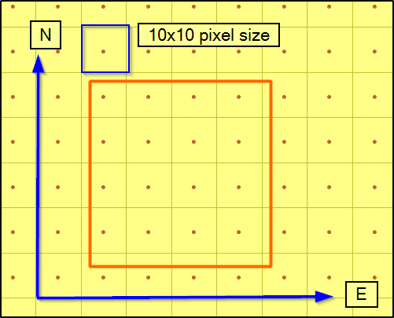
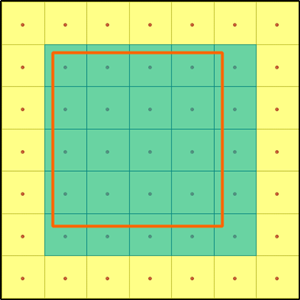
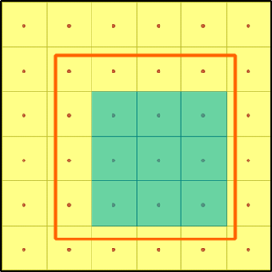
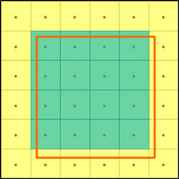

[[selecting-pixels-section]]
=== Selecting Pixels

Imagine to have some raster data with pixel size 10 by 10 units and bbox starting at 0,0. Let's put the anchor point at the centre of the pixel. Now user requests a subset as

``&SUBSET=E(572,612)&SUBSET=N(477,518)``

Which pixels should be selected?  

A) All pixels that intersect with the subset

B) Only pixels which all totally contained by the subset

C) Only pixels whose anchor points are within the subset

With plain GetCoverage no resampling nor scaling should happen and if I understand right, in all three cases the envelope of the result is different from the envelope of the subsetting request. Also, if user sends a new request with subset envelope that is adjacent to the previous one, interpretation A would give duplicate pixels, interpretation B) would lead to rows of missing pixels, and only alternative C) would give a resultset that is adjacent to the first resultset.

These sections in the WCS 2.0 Core deal somehow with the case but I feel that they do not answer my question.

> The WCS Core standard defines  
> 
> the domain subsetting operation which delivers all data from a coverage inside a specified  
> 
> request envelope (“bounding box”), relative to the coverage’s envelope – more precisely, the  
> 
> intersection of the request envelope with the coverage envelope.

> Requirement 32 /req/core/getCoverage-request-trim-within-extent:  
> 
> Let the extent of the coverage’s gml:Envelope along the dimension specified in the trim  
> 
> request range from L to H. Then, for the trim bounds trimLow and trimHigh the following  
> 
> shall hold: L <= trimLow <= trimHigh <= H.

> Let further  
> 
> c be the OfferedCoverage of the server addressed;  
> 
> low = tLow if specified in the request, otherwise low is set to the coverage’s lower  
> 
> bound in dimension dname;  
> 
> high = tHigh if specified in the request, otherwise high is set to the coverage’s upper  
> 
> bound in dimension dname;  
> 
> B be an envelope equal to the domain of c, except that in dimension dname the extent  
> 
> is given by the closed interval [low,high];  
> 
> Then, the following requirement holds:

> Requirement 38 /req/core/getCoverage-response-trimming:  
> 
> The response to a successful GetCoverage request on coverage identifier id of admissible  
> 
> type containing no slicing and exactly one trimming operation with dimension name dname,  
> 
> lower bound parameter evaluating to low, and upper bound parameter evaluating to high  
> 
> shall be a coverage identical to c, but containing all points of c with location inside B, and  
> 
> no other points.  
> 
> NOTE This requirement does not specify the actual extent of the coverage
>  returned. Possible options include: the minimal bounding box of the 
> coverage returned, or the request bounding box. Servers are strongly 
> encouraged to deliver the minimal bounding box.

I believe the correct answer is C.  At least that's the way CubeWerx has implemented it.  The way I see it, coverages typically deal with points, not pixels.  When a coverage is returned in a pixel-based representation such as GeoTIFF, it represents each sample point by a pixel, where the sample point is at the centre of each pixel.  If a sample point intersects the requested subset, it should be returned in the GeoTIFF response as a pixel; otherwise it shouldn't.

CubeWerx's implementation of the various OGC web services distinguishes between what we call a "cell-based" extent (used, for example, by WMS) and a "grid-based" extent (used, for example, by WCS). A grid-based extent is always one pixel smaller in each dimension (0.5 pixels per side) than its corresponding cell-based extent.

So if there's a sample point at each integral unit and a coverage subset of E(572,612) N(477,518) is requested, the resulting GeoTIFF will contain 41x42 pixels (representing 41x42 sample points).  Its grid-based extent is exactly what was requested (572,477 to 612,518) but its cell-based extent (that is, corner to corner) is 571.5,476.5 to 612.5,518.5.  It you wanted to make a map request of this coverage subset, that'd be the extent you'd specify.

If a coverage subset of E(571.9,612.1) N(476.9,518.1) is requested, you'd get exactly the same response.

However, if a coverage subset of E(572.1,611.9) N(477.1,517.9) is requested, you'd get a response that's only 39x40 pixels in size, representing the subset E(573,611) N(478,517).  It would have a grid-based extent of 573,478 to 611,517 and a cell-based extent of 572.5,478.5 to 610.5,517.5.

Reference This existing OGC document may have material you can reuse:  http://docs.opengeospatial.org/is/10-140r2/10-140r2.html[http://docs.opengeospatial.org/is/10-140r2/10-140r2.html] <http://docs.opengeospatial.org/is/10-140r2/10-140r2.html[http://docs.opengeospatial.org/is/10-140r2/10-140r2.html]>

